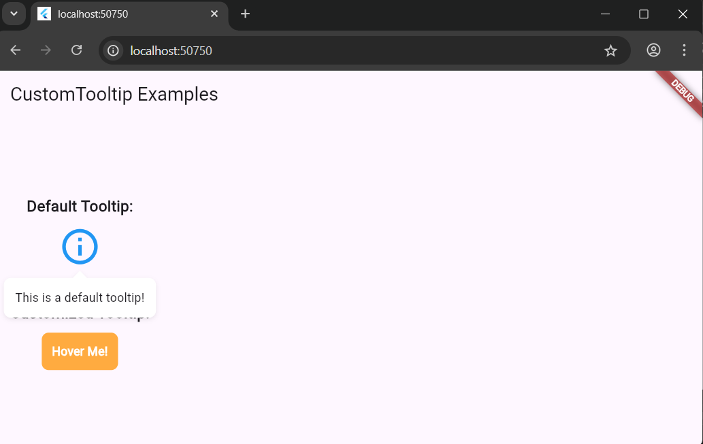
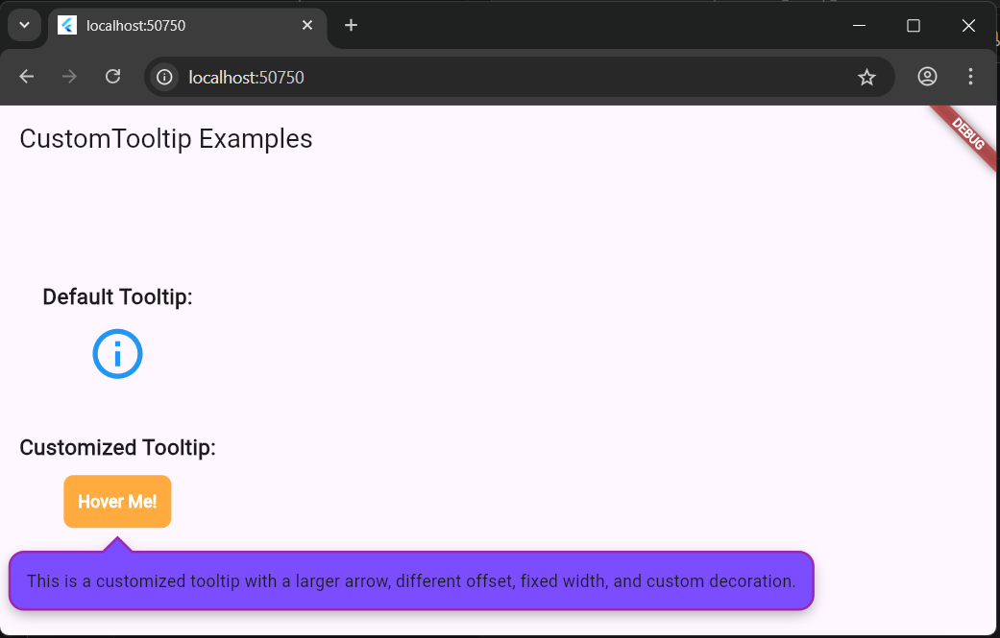

# Custom Tooltip Flutter

[](https://pub.dev/packages/custom_tooltip_flutter)
[](https://opensource.org/licenses/MIT)

A highly customizable tooltip widget for your Flutter applications. Display informative messages when users interact with your widgets through hover (desktop/web) or tap/hold (mobile) gestures.

## Screenshots

### Default Tooltip

*Default tooltip with clean, minimal design*

### Customized Tooltip

*Fully customizable tooltip with custom colors, border radius, and shadow*

## Features

* **Platform-Specific Interactions**:
  - Desktop/Web: Hover to show/hide tooltip
  - Mobile: Tap to toggle or hold to show (configurable)
* **Multiple Positions**: Position tooltips above, below, left, or right of the target widget
* **Fully Customizable Content**: Use any widget as the content of your tooltip
* **Customizable Appearance**: Control arrow size, offset, width constraints, and apply custom `BoxDecoration`
* **Smooth Animations**: Built-in fade and scale animations
* **Responsive Design**: Automatically adjusts position based on available space
* **Pure Dart**: Works on all platforms supported by Flutter

## Getting Started

Add `custom_tooltip_flutter` to your `pubspec.yaml` file:

```yaml
dependencies:
  custom_tooltip_flutter: ^0.1.0
```

Then, run `flutter pub get` in your terminal.

## Usage

Import the package in your Dart file:

```dart
import 'package:custom_tooltip_flutter/custom_tooltip_flutter.dart';
```

### Basic Example

```dart
CustomTooltip(
  tooltipContent: const Text('This is a simple tooltip!'),
  child: const Icon(Icons.info),
)
```

### Advanced Example with Customizations

```dart
CustomTooltip(
  tooltipContent: Container(
    padding: const EdgeInsets.all(8.0),
    child: const Text(
      'This is a customized tooltip with a larger arrow, different offset, and custom decoration.',
      textAlign: TextAlign.center,
    ),
  ),
  arrowSize: 12.0,
  offset: 8.0,
  minWidth: 200.0,
  maxWidth: 300.0,
  preferredPosition: PreferredPosition.below,
  decoration: BoxDecoration(
    color: Colors.deepPurpleAccent,
    borderRadius: BorderRadius.circular(12),
    boxShadow: [
      BoxShadow(
        color: Colors.black.withOpacity(0.3),
        blurRadius: 8,
        offset: const Offset(0, 4),
      ),
    ],
    border: Border.all(
      color: Colors.purple,
      width: 2,
    ),
  ),
  child: Container(
    padding: const EdgeInsets.all(12.0),
    decoration: BoxDecoration(
      color: Colors.orangeAccent,
      borderRadius: BorderRadius.circular(8),
    ),
    child: const Text(
      'Hover Me!',
      style: TextStyle(color: Colors.white, fontWeight: FontWeight.bold),
    ),
  ),
)
```

### Mobile-Specific Example (Hold Gesture)

```dart
CustomTooltip(
  tooltipContent: const Text('Hold to see more information'),
  useHoldGesture: true, // Enable hold gesture on mobile
  child: const Icon(Icons.info),
)
```

## Properties

The `CustomTooltip` widget accepts the following properties for customization:

* `child`: (Required) The widget that will trigger the tooltip
* `tooltipContent`: (Required) The widget to display as the content of the tooltip
* `arrowSize`: `double` (default: `8.0`) - The size of the arrow pointing to the child widget
* `offset`: `double` (default: `4.0`) - The distance between the child widget and the tooltip
* `minWidth`: `double?` (optional) - The minimum width for the tooltip content
* `maxWidth`: `double?` (optional) - The maximum width for the tooltip content
* `decoration`: `BoxDecoration?` (optional) - Custom decoration for the tooltip container
* `padding`: `EdgeInsetsGeometry?` (optional) - Custom padding for the tooltip content
* `preferredPosition`: `PreferredPosition` (default: `PreferredPosition.below`) - The preferred position of the tooltip
* `useHoldGesture`: `bool` (default: `false`) - Whether to use hold gesture instead of tap on mobile devices

## Platform-Specific Behavior

* **Desktop/Web**: Tooltips appear on hover and disappear when the mouse leaves
* **Mobile (Default)**: Tooltips toggle on tap
* **Mobile (with `useHoldGesture: true`)**: Tooltips appear on hold and disappear on release

## Contributing

Contributions are welcome! If you find any issues or have suggestions for improvements, please open an issue or submit a pull request on the [GitHub repository](https://github.com/ngtrongha/custom_tooltip_flutter).

## License

This package is licensed under the MIT License - see the [LICENSE](LICENSE) file for details.

